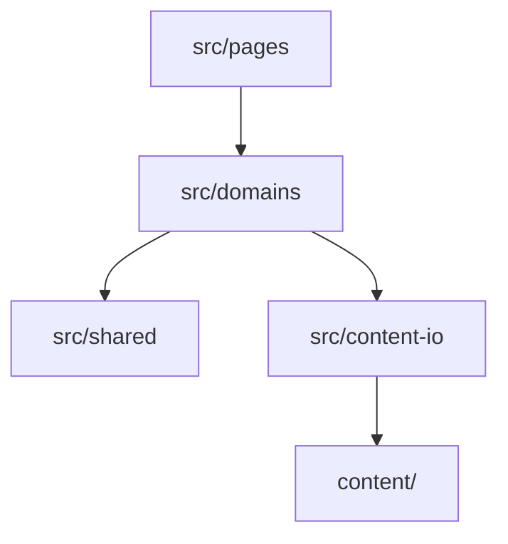

# Cogniflux 架构文档（基线方案落地版）

> 本文档是架构基线方案的落地版：记录实际实现的技术路线、目录职责、依赖方向、延后决策的触发条件与 monorepo 迁移步骤，并如实记录与基线的实现偏差。基线文档存于 `.qoder/plans/`，本文档以仓库实际代码为准。

## 1. 技术路线（D1–D7 落地状态）

| # | 决策 | 落地实现 |
|---|---|---|
| D1 框架 | Vite + React Router 框架模式，prerender 输出静态 HTML | 实际为 **React Router v8**（v7 框架模式的延续，配置模型一致）。`react-router.config.ts`：`ssr: false` + 异步 `prerender()` 枚举全部路径 |
| D2 仓库 | 单一前端仓库 + pnpm，不做 monorepo | alias：`@/* → src/*`、`@content/* → content/*`（见 `vite.config.ts` 与 `tsconfig.json`）；域边界保证未来可拆 |
| D3 内容 | 文章/实验用 MDX，结构化数据用 TS 文件；根目录 `content/`；Zod 构建期校验 | `content/articles/{年}/{slug}/index.mdx`、`content/lab/{slug}.mdx`、`content/data/*.ts`；校验双入口：`pnpm validate-content` + vite `buildStart` 插件（坏 frontmatter = 构建失败，报错含文件路径） |
| D4 设计系统 | 两层令牌（primitive → semantic）落 CSS Variables，Tailwind v4 `@theme inline` 引用 | `src/styles/tokens.css`（唯一事实来源）+ `themes/{light,dark}.css`（只覆盖 Semantic 层）+ `globals.css` 的 `@theme inline` 映射 |
| D5 组件 | 自建基础 UI（CVA）+ 选择性 Radix 复杂交互组件 | `src/shared/ui/`：Button/Card/Badge/Tag/Input/Skeleton/EmptyState/Separator 自建；Dialog/Tabs/Tooltip 基于 `@radix-ui/react-*` 重刷令牌 |
| D6 动效 | Motion + LazyMotion 按需加载，收敛为 primitives，全站尊重 reduced-motion | `src/shared/motion/`：FadeIn/SlideUp/Stagger/PageTransition/Collapse + `tokens.ts`（与 tokens.css 同源同值）；`src/app/providers.tsx` 全局 LazyMotion |
| D7 部署 | Vercel + GitHub Actions 最小流水线 | `.github/workflows/ci.yml`：install → typecheck → lint → validate-content → test → build |

## 2. 目录结构与职责

```
cogniflux/
├── content/               # 内容源（独立于 src）
│   ├── articles/2026/{slug}/index.mdx   # 每篇一个目录，图片同目录
│   ├── lab/{slug}.mdx
│   ├── data/              # 结构化内容（TS）：projects/agents/tools/now/profile/site
│   └── _templates/        # article.mdx / lab.mdx frontmatter 模板
├── src/
│   ├── root.tsx           # 根布局（含主题防闪烁脚本）——位于 src/ 根（见 §5 偏差②）
│   ├── routes.ts          # 路由表：8 栏目 + 4 条详情路由 + /dev/ui + 404
│   ├── app/providers.tsx  # LazyMotion 等全局 Provider
│   ├── pages/             # 路由页面：仅组合 domains/shared 组件 + 调用 repository
│   ├── domains/           # 8 领域：articles/projects/agents/lab/now/toolbox/profile/site
│   │   └── x/{types.ts, schema.ts, repository.ts, components/, index.ts}
│   ├── shared/            # ui / components / motion / seo / types / utils
│   ├── content-io/        # mdx.ts / loader.ts / validate.ts（唯一触碰内容文件的层）
│   ├── services/agent/    # AgentGateway 接口 + mock（阶段 1 仅此两文件）
│   └── styles/            # tokens.css / themes/{light,dark}.css / globals.css
├── scripts/               # content-urls.ts / generate-seo.ts / validate-content.ts
├── docs/                  # 本文档 + CONTENT/DESIGN/CHECKLIST + adr/
└── tests/                 # content / domains / services / shared 单测（Vitest）
```

### 职责边界（允许 / 禁止）

| 目录 | 允许 | 禁止 |
|---|---|---|
| `content/` | 内容文件、同目录图片、TS 数据 | 组件/逻辑代码；被 pages/components 直接 import |
| `src/pages/` | 组合组件、调用 repository、页面级 SEO（`buildMeta`） | 定义可复用组件；直接解析内容文件 |
| `src/domains/x/` | 领域类型、Zod schema、repository、领域组件 | import 其他领域内部（跨领域只经对方 `index.ts`） |
| `src/shared/ui` | 零业务原子组件，仅消费令牌 | 出现任何领域词汇 |
| `src/shared/components` | ≥2 个领域复用的复合组件 | 单领域专属组件 |
| `src/content-io/` | 文件扫描、MDX 编译、frontmatter 校验 | 被 pages/components 直接调用（只服务 repository） |
| `src/services/agent/` | 接口定义 + mock | 任何真实密钥、真实 LLM SDK 调用 |
| `src/styles/` | 令牌、主题、全局样式、prose 排版 | 页面专属样式 |

> 页脚为展示型组件：站点信息（标题/URL/社交链接）由 root 壳层经 domains 出口拉取后以 props 传入；页脚导航如需要应消费 `domains/site` 的 `Navigation.footer`，不得在组件内硬编码。

## 3. 依赖方向



- 总则：`pages → domains → shared →（无依赖）`；**任何层禁止反向依赖**。
- `content-io` 只被 domains 的 repository 使用；页面/组件禁止直接 import `content/**`。
- 以上由 `eslint.config.js` 的两条 `no-restricted-imports` 规则强制：
  1. `src/pages/**`、`src/domains/**/components/**` 禁止 import `content/**`；
  2. `src/shared/**` 禁止 import `domains/pages`。
- 跨领域引用只经对方 `index.ts`（如 `src/domains/site/references.ts` 聚合五个领域的 `getXxxReferenceRecords()`）。

## 4. 延后决策与触发条件

| 事项 | 触发条件 | 届时方案 |
|---|---|---|
| 搜索 | 内容 **>50 篇** | 先 Fuse.js（构建期轻量索引）；>200 篇再换 Pagefind |
| CMS | 出现**多人编辑**（非技术编辑者）或强烈需要网页端写作 | 首选 Keystatic（Git-based，内容仍是 MDX，零迁移）；数据只经新的 repository 适配器进入 |
| monorepo 化 | 出现**第二个应用**（如 agent-api） | 见 §6 迁移步骤 |
| 迁 Next.js | 需要**运行时服务端渲染**（动态 OG 图、登录态 + SEO 并存的混合渲染） | loader/route 模型与 Next.js 同构，迁移量约 1.5–2.5 周，组件/样式/令牌 100% 复用 |
| Agent 后端形态 | 阶段 3 真实 Agent 能力上线 | Vercel Functions vs 独立服务届时决策；前端只换 `AgentGateway` 实现 |
| 组件测试 / E2E | 阶段 2 关键交互组件 / 阶段 3 有 Agent 交互后 | Vitest 组件测试 / Playwright |
| 对象存储 | 仓库 >300MB 或 clone 明显变慢 | 视频、大截图集出仓库 |

**第一阶段不建**（防过度设计）：`packages/`、`apps/`、`server/`、Storybook（用 `/dev/ui` 路由页替代）、E2E 目录。

## 5. 与基线的实现偏差记录

1. **React Router 版本**：基线写 v7，实际落地为 **v8**（`react-router@^8`、`@react-router/dev@^8`）。v8 是 v7 框架模式的延续，`react-router.config.ts` 的配置模型（`ssr`/`prerender`/`appDirectory`）与 v7 一致，基线中关于 v7 的全部论述照常成立。
2. **应用壳层位置**：基线规划 `src/app/{root.tsx, routes.ts, providers.tsx}`；实际配置 `appDirectory: "src"`，因此 **`root.tsx` 与 `routes.ts` 位于 `src/` 根目录**（React Router 约定文件必须在 appDirectory 根），`src/app/` 下仅保留 `providers.tsx`。
3. **prerender 路径枚举**：基线设想经领域 repository 枚举；实际经 **`scripts/content-urls.ts`（node fs + gray-matter 扫描 MDX、相对导入 `content/data/*.ts`）**。原因是 React Router 加载 config 时的运行环境没有项目 alias 与 `import.meta.glob` 管线（技术限制）。该脚本与领域层遵循同一套过滤规则（生产只出 `published`），并同时服务 `generate-seo.ts`（sitemap/RSS）。
4. **Agent 详情页“局限”区块**：基线内容模型的 Agent 详情页含“局限说明”；实际 schema **没有 `limitations` 字段**，`src/pages/agents/detail.tsx` 的“当前局限”区块基于 `agentStatus` 状态文案（`AGENT_STATUS_LABEL`）生成。若未来需要逐 Agent 自定义局限说明，再向 `agentSchema` 增补字段。

另有两处轻微差异，不影响架构：`entry.client.tsx / entry.server.tsx` 未显式创建（使用 React Router 默认入口）；`public/` 下为 `favicon.ico`（非基线示例中的 `favicon.svg`），暂无 `fonts/` 目录（正文使用系统字体栈）。

## 6. 静态托管要求（prerender 产物）

`ssr: false` + `prerender()` 的构建产物是**目录式静态站点**：每条路由输出各自的 `build/client/<route>/index.html`（如 `now/index.html`、`agents/pr-reviewer/index.html`），根路由为 `build/client/index.html`，另有 `__spa-fallback.html` 供未 prerender 的动态路径客户端兜底。因此静态托管必须满足两条：

1. **按目录解析 index.html**：请求 `/now` 要命中 `now/index.html`（即 cleanUrls / directory-index 行为）。
2. **禁止把所有路径 SPA 重写到根 `index.html`**：否则直访 `/now` 拿到的是首页 HTML，客户端 hydration 时发现 URL（`/now`）与内嵌的预渲染路由数据（`/`）不匹配，直接抛错渲染 ErrorBoundary「出错了」。注意菜单点击（客户端导航）不经此路径故看似正常，只有地址栏直访/刷新才暴露。

**本地预览**：用 `pnpm preview`（即 `serve build/client -l 3000`，**不带 `-s/--single`**）。`serve` 默认 cleanUrls 会正确把 `/now` 解析到 `now/index.html`。⚠️ 切勿使用 `serve -s build/client`——`-s` 是 SPA 模式，会把一切路径重写到根 `index.html`，正是上面第 2 条描述的缺陷成因。

**Vercel（生产）**：Vercel 静态部署天然按文件系统 / cleanUrls 解析目录 `index.html`，`/now` 自动命中 `now/index.html`，**不做全局 SPA 根重写**，因此无此问题，无需额外 `vercel.json`。仅当希望未 prerender 的未知路径（如错误 slug）也渲染站内品牌 404 页时，才需在 `vercel.json` 增加一条把未命中路径 rewrite 到 `/__spa-fallback.html` 的规则；当前默认行为下未知路径返回 404 状态（对 SEO 更正确），已 prerender 的 `/404` 页可直接访问。

## 7. monorepo 迁移步骤（届时执行，每步可独立回滚）

1. 创建 `pnpm-workspace.yaml`（仓库已有占位文件），新建 `apps/web/`，整体移动 `src/ public/ content/ vite.config.ts react-router.config.ts` 等（git mv，一次提交）。
2. alias 不变（`@/`、`@content/` 相对包根解析），页面代码零修改。
3. 出现第二个消费方时，把 `src/domains/*/schema.ts` 抽到 `packages/content-schema`，原位置 re-export 保持兼容。
4. Agent 后端以 `apps/agent-api` 新增，前端只把 `AgentGateway` 的实现从 mock 换成 fetch 版。

## 8. 看板娘 / TwinSparkBot（已落地）

> 详细的形象制作/更换指南见 [COMPANION.md](./COMPANION.md)，决策依据见 [ADR-009](./adr/ADR-009-看板娘形象与代码解耦.md)。本节取代早期“首页 Hero `companion-slot` 首次交互挂载 + `src/services/live2d/`”的预留方案（首页空槽位已删除，Live2D 路线已否决，见 ADR-009）。

- **挂载位**：`src/root.tsx` 布局层全站常驻右下角 `<CompanionHost />`。移除该行即可全站下线。
- **代码结构**：`src/services/companion/{types, prefs, bridge, loader, index}.ts` 为纯逻辑层（ESLint 第三条 `no-restricted-imports` 规则禁止其 import `domains/pages/shared`）；`src/shared/components/companion/{companion-host, companion-poster, companion-stage}.tsx` 为展示组件。
- **双形态与降级**：水合后 `requestIdleCallback` 探测 `public/companion/companion.riv`——存在则懒加载 Rive 模式（`@rive-app/react-canvas-lite` 独立 chunk，不进首屏关键路径，守 ADR-006 首页 180KB gzip 预算）；不存在或加载/运行失败则**静默回退**静态立绘模式（`public/companion/poster.webp` + 仅 transform 的呼吸浮动，尊重 reduced-motion）。
- **双契约**（形象与代码解耦的关键，见 ADR-009）：契约 A 资产路径固定；契约 B 状态机命名固定（State Machine 名 `Companion`、五状态见 `src/services/companion/types.ts` 的 `COMPANION_STATES`，契约快照测试守护）。更换形象零代码改动。
- **用户偏好**：`localStorage` 的 `companion:dismissed` / `companion:minimized`；移动端默认收起；关闭后不再渲染。
- **安全边界**：`bridge.ts` 纯函数 `agentEventToCompanionState` 预埋 Agent 事件到状态的映射，本期不真实订阅；二期接 `src/services/agent/` 的 AgentGateway，**前端永不持有任何 Key/Token**（ADR-008 边界不变），禁止在看板娘层直接调用 LLM SDK。

## 9. 相关文档

- [CONTENT.md](./CONTENT.md)：内容写作规范与 frontmatter 字段字典
- [DESIGN.md](./DESIGN.md)：设计令牌与主题使用法
- [CHECKLIST.md](./CHECKLIST.md)：发布前检查清单
- [COMPANION.md](./COMPANION.md)：看板娘形象制作与更换指南
- [adr/](./adr/)：ADR-001…009 架构决策记录
- [../AGENTS.md](../AGENTS.md)：AI 协作规则（每次会话自动读取）
