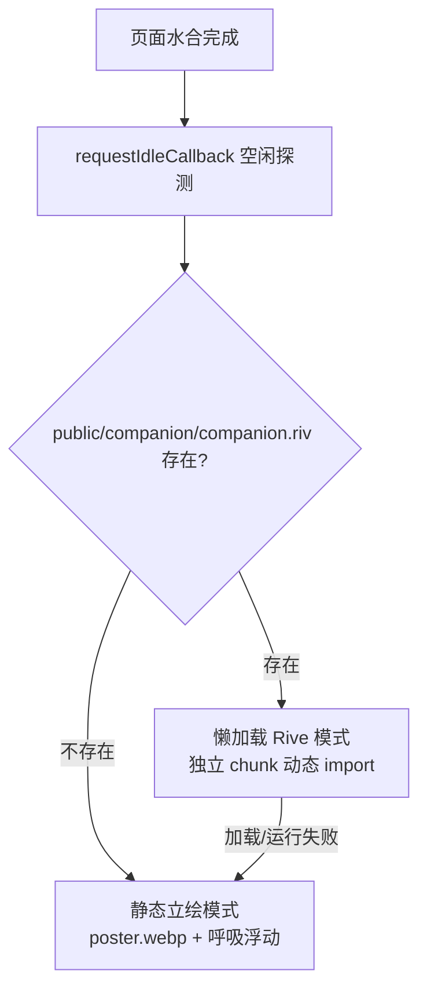

# 看板娘（TwinSparkBot）形象制作与更换指南

> 本文档面向"给网站换形象"的场景：说明看板娘的双形态机制、Rive 模型的制作约束、三条形象更换路径与验收清单。架构决策依据见 [ADR-009](./adr/ADR-009-看板娘形象与代码解耦.md)，系统落地描述见 [ARCHITECTURE.md §8](./ARCHITECTURE.md)。

## 1. 概述：双形态与自动切换

看板娘由 `src/root.tsx` 布局层全站常驻挂载（右下角 `<CompanionHost />`），运行时按资产存在性自动选择形态，**形象是纯资产，代码零感知**：

- **Rive 模式**：`@rive-app/react-canvas-lite` 以动态 `import()` 拆独立 chunk，探测到 `companion.riv` 后才加载，**不进首屏关键路径**（守 ADR-006 首页 180KB gzip 预算）。
- **静态立绘模式**：`public/companion/poster.webp` + 仅 `transform` 的呼吸浮动动画，尊重 `prefers-reduced-motion`。Rive 加载或运行期任何失败均**静默回退**到此形态，不报错不白屏。
- **用户偏好**：`localStorage` 记录 `companion:dismissed`（关闭后不再渲染）与 `companion:minimized`；移动端默认收起。

代码只依赖两条契约（详见 ADR-009）：

| 契约 | 内容 |
|---|---|
| A：资产路径 | `public/companion/poster.webp`、`public/companion/companion.riv` |
| B：状态机命名 | State Machine 名固定 `Companion`；五状态 `idle / greeting / listening / thinking / speaking`，唯一真值源为 `src/services/companion/types.ts` 的 `COMPANION_STATES`，由 `tests/services/companion.test.ts` 契约快照守护 |

## 2. Rive 模型制作指南

在 Rive 编辑器中制作模型时必须满足以下约束（契约 B 为硬约束，违反会导致状态驱动失效）：

| 项 | 要求 |
|---|---|
| 画板尺寸 | 建议 **512 × 768 竖版**（与右下角挂载区域比例一致） |
| State Machine 名 | 必须命名为 **`Companion`**（区分大小写） |
| 状态名 | 五个状态必须与 `COMPANION_STATES` **完全一致**：`idle`、`greeting`、`listening`、`thinking`、`speaking` |
| 输入命名约定 | 交互 trigger 建议用动词小写命名（如 `wave`、`tap`），便于前端按约定绑定 |
| 体积 | 导出 `.riv` 建议 **≤200KB**（含纹理；超出需压缩图层位图） |
| 部署方式 | 导出后放入 `public/companion/companion.riv`，**前端自动探测点亮 Rive 模式**，无需改任何代码 |

> 修改状态名/状态机名前先看 `tests/services/companion.test.ts` 的契约快照——快照不改，模型侧就不能改。

## 3. 形象更换指南（三条路径）

### 路径①：更换静态立绘（分钟级，最常用）

1. AIGC 重新生成形象图（保持角色风格一致性可复用原提示词/参考图）。
2. 抠除背景，导出 **webp**：体积 **≤150KB**，建议最长边 **640px**。
3. 覆盖 `public/companion/poster.webp`（文件名不变）。
4. `pnpm build` 后部署。全程零代码改动。

### 路径②：更换 Rive 模型皮肤（前端零改动）

1. 将新立绘图层导入**现有 Rive 工程**——骨骼绑定与 State Machine 直接复用，只替换美术图层。
2. 校验契约 B 不变：State Machine 仍名 `Companion`，五状态名不动。
3. 导出并覆盖 `public/companion/companion.riv`，部署。

### 路径③：回退 / 下线

- **回退静态模式**：删除 `public/companion/companion.riv` 即可，探测失败自动走 `poster.webp`。
- **全站下线**：在 `src/root.tsx` 中移除 `<CompanionHost />` 一行（这是唯一需要动代码的操作）。

## 4. 更换验收清单

按顺序执行，全部通过才算更换完成：

- [ ] 本地 `pnpm dev` 目视生效：新形象正常展示、动画/浮动正常。
- [ ] light / dark 双主题下检查立绘边缘（抠底残留在深色背景下最易暴露），无违和。
- [ ] `pnpm test` 通过——尤其 `tests/services/companion.test.ts` 契约快照（换 Rive 模型时最关键）。
- [ ] 部署后**强制刷新**验证。注意 HTTP 缓存：`poster.webp` / `companion.riv` 文件名不变，浏览器可能命中旧缓存——可在引用处临时加版本 query（如 `?v=2`），或等 `max-age` 自然失效后复查。

## 5. AgentGateway 二期接线方式

看板娘的"对话感知"能力预埋在 `src/services/companion/bridge.ts`：纯函数 `agentEventToCompanionState` 已定型 `AgentEvent → CompanionState` 的映射——

| AgentEvent | CompanionState |
|---|---|
| `start` | `thinking` |
| `delta` | `speaking` |
| `tool` | `thinking` |
| `done` / `error` | `idle` |

**本期不做真实订阅**。二期接线步骤：订阅 `src/services/agent/` 的 `AgentGateway` 流式事件（`AsyncIterable<AgentEvent>`）→ 逐事件经 `agentEventToCompanionState` 映射 → 驱动 Rive 状态机 input 切换状态。安全边界不变：对话调用只走 AgentGateway，**前端永不持有任何 Key/Token**（ADR-008）。
